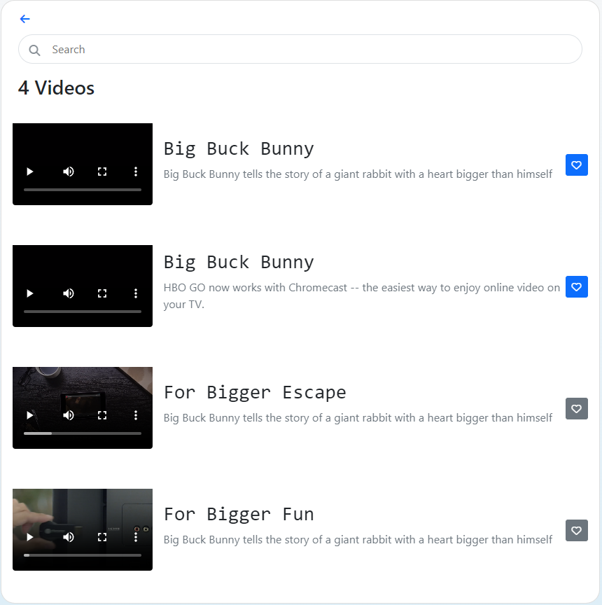

# Video Listing App React

React video listing app. It has been almost covered all the concept of the React. ex: React Component rendering, props, react-router-dom, useState, useEffect, useContext hooks, calling API using fetch so on. Use json-server as filling backend.  
Make sure that for deprecation warning some feature may need to install after npm install. Ex: npm i json-server

## Refer

React Docs https://react.dev/

## Setup

Install the app with npm

```bash
  clone or fetch

  cd project name

  npm install

  npm start

  npm run backend

```


